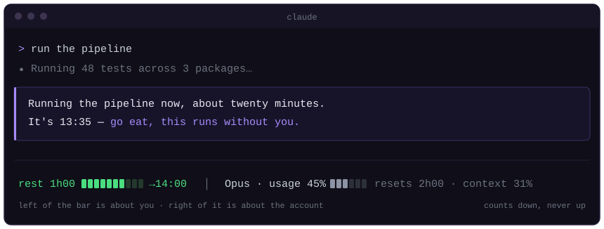

# breather

[](https://github.com/ilandahan/breather/actions/workflows/check.yml)
[](LICENSE)


**Claude Code will work as long as you will. This gives you a way out.**



```
curl -fsSL https://raw.githubusercontent.com/ilandahan/breather/main/install.mjs | node -
```

<details>
<summary>Windows PowerShell, or install as a plugin</summary>

```powershell
iwr -useb https://raw.githubusercontent.com/ilandahan/breather/main/install.mjs -OutFile $env:TEMP\breather.mjs; node $env:TEMP\breather.mjs
```

As a Claude Code plugin — this installs the skill and the four hooks, but not
the status line, which is a `settings.json` field a plugin cannot set:

```
/plugin marketplace add ilandahan/breather
/plugin install breather@breather
```

Nothing is downloaded at runtime and there are no dependencies: one file, Node
18+, stdlib only. Read it before you run it — `install.mjs` is generated from
[`skills/`](skills/) and [`hooks/`](hooks/) in this repo, and CI fails if the
two ever drift apart. `--dry-run` prints every change and writes nothing.

</details>

Sessions with an AI have no natural end. There is always a next thing, the answer to "what now?" is never "stop", and the longer you stay the more expensive leaving becomes — because the context dies with the session and tomorrow you start cold.

So people don't leave. They work through lunch, they work past dark, and the tool that could have said something says nothing, because nobody built it to.

`breather` builds it. It tracks how long you have actually been present, notices the fixed points in your day, and at safe moments offers a way out with the work written down so you can pick it up later. Leaving stops being expensive.

## What it will not do

The point is to protect you, so the design starts from the ways a tool like this goes wrong:

**It will not measure you.** No hours logged, no productivity score, no "you worked 3h20m today". A meter is the opposite of care — it turns your own tool into something you answer to. The one number it shows counts *down* to a break, never up from a start time.

**It will not lecture you.** It never says you should rest, never comments on your hours, never mentions your health. It notes that a boundary exists. What you do with it is yours.

**It will not block you.** No hard gate, no lockout. An offer you can decline is the whole design — a tool that overrules you gets bypassed within a week, and then you have neither the tool nor the trust.

**It will not nag.** One offer an hour at most, across every session. It waits for a safe moment and never interrupts mid-problem. An ignored offer counts as a no.

**It will not push you to work more.** It reads your subscription usage, and that data may only ever support stopping. It will never tell you how much quota you have left, because remaining headroom is not an instruction.

## What it does instead

It asks once in the morning what your day looks like — meetings, lunch, when you want to finish — and from then on those are its anchors. Not thresholds it invented about your stamina: your own calendar, read back to you. "You said six" is a quote, not a judgement.

And it watches for the moment you were going to be free anyway. When a long run starts, that is not an interruption to make — it is a window that just opened:

> Running the pipeline now, about twenty minutes. It's 13:35 — go eat, this runs without you.

That sentence is the whole product.

## Three surfaces, three jobs

| Surface | Role | Rule |
|---|---|---|
| Status line | state — always there | never interrupts, no Hebrew (terminal bidi) |
| OS notification | event — persists until seen | fires when the terminal isn't being watched |
| A line in the reply | offer — you're reading anyway | one line, end of message, same shape every time |

## The status line

```
rest 1h00 ▓▓▓▓▓▓▓░░░ →14:00  │  Opus · usage 45% ▓▓▓░░░ resets 2h00 · context 31%
```

The vertical bar splits it: **left is about you, right is about the account.**

- `rest` — minutes until the next stopping point. Counts down, not up.
- `→14:00` — appears only when a planned anchor is what's binding the countdown.
- `usage` — the five-hour subscription window, with its reset.
- `week` / `spend` — only above 60% and 70%. Below that they are noise.
- `extra usage` — red, once past the plan limit and drawing on usage credits.
- `api billing ~$1.23` — red, when billing per token instead. The `~` is deliberate: that figure is a client-side estimate at list price and may differ from the actual bill.

Collapses by terminal width. At 60 columns: `rest 1h00 │ usage 45%`.

## The day

**First session after 04:00.** A notification card greets you as the session opens — *type your day plan into Claude: meetings and calls, lunch time, and when you want to finish*. It is an instruction, not a question: the card only has a "Got it" button, the answers go into the chat. Claude opens its first reply with the same three questions before anything else. One notification, one ask, machine-deduplicated across sessions. A partial answer is a complete answer, silence is a decline, and it is never raised again that day.

On Windows the card is a custom topmost window — dark, purple-glow border, bottom-right corner — so it lands above the terminal instead of behind it.

**Recurring plans.** A schedule you state as a rule — "every day I stop at 12 for school pickup" — is recorded once (`recur set sun-thu anchors 12:00`) and seeds every matching day automatically. On a seeded day the card and the morning ask both shrink to *what's different today?*. Recording a new meeting merges into the day's list; it never wipes the seed.

**Calendar.** At the day's first session, if any calendar connector is available in Claude — Google Calendar / Gmail, Microsoft 365 / Outlook — today's meetings are pulled and recorded as anchors automatically — one line tells you what landed. No connector, no problem: one quiet line, then the normal morning ask. No OAuth in breather itself; the connector belongs to your claude.ai account, so this works identically on Windows, macOS, and Linux.

A session left open from yesterday counts too: the first prompt of the new day gets the same morning flow — card, ask, calendar — without reopening anything.

**During the day.** Presence accumulates across every session, with idle gaps over 20 minutes removed. Zones escalate: silent, then one closing line, then three options, then a drafted handoff. Night moves everything up a zone. A planned anchor overrides the ladder — you're standing up for that meeting regardless.

Offers only land at safe boundaries: a gate passed, tests green, a commit, a question resolved. Never mid-fix. One per hour at most, globally, and an ignored offer counts as a decline.

**Before something long.** Claude checks the clock first, because the moment it starts running is a moment you're free anyway. "It's 13:35, go eat, this runs without you."

**At the end.** A handoff to `.aid/handoff/`, and the next session opens with its next step.

## Files

```
~/.claude/skills/breather/
  SKILL.md
  references/handoff-template.md

~/.claude/hooks/breather/
  presence.mjs      shared store: heartbeats, zones, plan, quota cache
  session-open.mjs  SessionStart — injects the skill, day plan, open handoff
  clock.mjs         UserPromptSubmit — human heartbeat, injects the clock line
  activity.mjs      PostToolBatch — work heartbeat, fires window notifications
  notify.mjs        OS notification, cross-platform — on Windows a topmost
                    WPF card via a Start-Process hop (a detached powershell
                    executes nothing, so the caller launches a short-lived
                    outer shell that starts an independent inner one)
  mark.mjs          state commands Claude calls
  statusline.mjs    the status line, and the quota data source
```

State lives in `~/.claude/state/breather/` — shared by every session on the machine.

## Commands

```
node ~/.claude/hooks/breather/mark.mjs anchors 11:00,15:30      # merges into today
node ~/.claude/hooks/breather/mark.mjs anchors-set 11:00        # replaces today's list
node ~/.claude/hooks/breather/mark.mjs lunch 13:00
node ~/.claude/hooks/breather/mark.mjs end 18:30
node ~/.claude/hooks/breather/mark.mjs recur set sun-thu anchors 12:00
node ~/.claude/hooks/breather/mark.mjs recur set * end 18:30
node ~/.claude/hooks/breather/mark.mjs recur list
node ~/.claude/hooks/breather/mark.mjs recur clear sun-thu
node ~/.claude/hooks/breather/mark.mjs skip
node ~/.claude/hooks/breather/mark.mjs snooze 90
node ~/.claude/hooks/breather/mark.mjs resumed
```

Recurring rules live in `~/.claude/state/breather/recurring.json` — `*` is the every-day base, day names (`sun`…`sat`) override it; anchors union, lunch/end day-specific wins.

## The clock line

Injected before every prompt. Claude reads it; you can see it with `/btw`.

```
[breather] worked=2h40m rest_in=20m now=13:35 zone=offer night=no
cooldown=0m sessions=3 busy=1 next_anchor=14:00 next_anchor_kind=meeting
next_anchor_in=25m day_ends=18:30 billing=plan usage=83% usage_resets_in=120m
```

Two independent clocks live here and they are never mixed in one sentence. `rest` is about the person; `usage` is about the subscription. "Three hours in and you're at 83%" is a performance report, not a boundary.

## Repo layout

```
skills/breather/SKILL.md            the skill — what the model reads
skills/breather/references/         handoff template
hooks/*.mjs                         the five hooks, the shared store, the status line
hooks/hooks.json                    hook wiring for plugin installs
.claude-plugin/                     plugin.json, marketplace.json
scripts/build-installer.mjs         embeds the tree above into install.mjs
scripts/test-install.mjs            installs into a throwaway home, asserts behavior
install.mjs                         generated, committed — this is what people curl
```

Edit anything under `skills/` or `hooks/`, then:

```
npm run build     # re-embed the tree into install.mjs
npm run check     # syntax
npm test          # install into a throwaway home and assert behavior
```

The built installer is committed on purpose: a one-liner that needs a build step first isn't a one-liner. It carries the tree above as a base64 payload, so `npm run build` is the only thing coupling the two — and CI fails the build if they drift, because a stale payload means the one-liner installs code that isn't in the repo.

`npm test` runs the real installer against an injected `CLAUDE_HOME` and checks what this README claims: files land byte-identical, four events register, re-running is idempotent, unrelated hooks and settings survive the merge, a status line that isn't ours is left alone without `--force`, `--dry-run` writes nothing, and `--uninstall` removes only its own entries.

See [AGENTS.md](AGENTS.md) before sending a change.

## Known weak points

In the order worth checking:

1. **The presence number.** If `rest` lies, everything above it is built on sand. Run a day with the status line only, no skill.
2. **The lock in `presence.mjs`** under several genuinely concurrent sessions — untested under load.
3. **Subagent detection in `activity.mjs`** relies on an environment variable that may not exist. If lunch notifications fire from inside agents, that's why — replace it with a `SubagentStart` flag.
4. **Machine-scoped state.** Remote sessions don't count toward presence.
